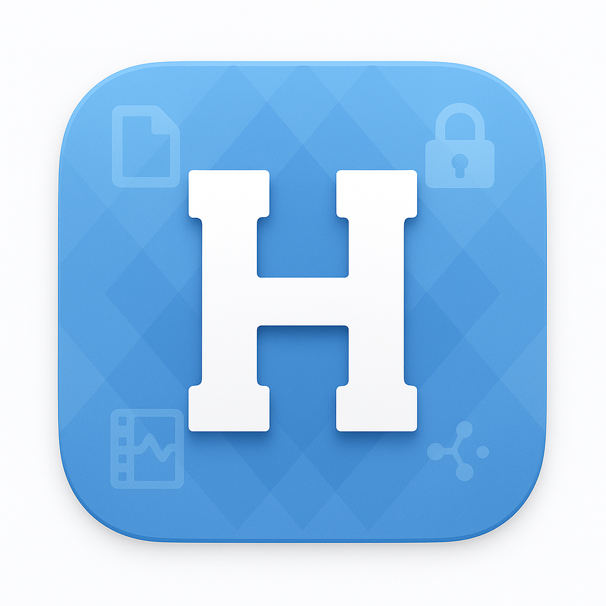

<div align="center">
  
  <h1>Heelworks</h1>
  <p><em>Personal toolkit launcher for macOS</em></p>
</div>

[](LICENSE)
[](https://github.com/Careycarroll/Script-Launcher/actions/workflows/tests.yml)

Heelworks is a personal macOS toolkit for document, vault, media, and local-AI-adjacent workflows.

The **Electron app is the primary frontend**. It includes the current launchpad UI, embedded terminal support, bundled Python document tools, Vault and Media workbenches, theme customization, and renderer tests. The Go TUI and Wails GUI remain in the repository as legacy/local frontends.

---

## Frontends

| Frontend      | Status       | Stack                   | Notes                                                            |
| ------------- | ------------ | ----------------------- | ---------------------------------------------------------------- |
| **Electron**  | Primary      | Electron + React + Vite | Launchpad, domain tiles, embedded terminal, bundled Python tools |
| **TUI**       | Legacy/local | Go + Bubble Tea         | Lightweight terminal launcher using `registry/registry.go`       |
| **Wails GUI** | Legacy/local | Go + Wails + React      | Earlier native GUI using the Go registry                         |

---

## Current Capabilities

### Documents

Electron document tools run through bundled Python scripts in `electron-app/resources/python/scripts/`.

| Tool               | Implementation                              | Notes                                        |
| ------------------ | ------------------------------------------- | -------------------------------------------- |
| PDF → Text         | `docpipe.py pdf_to_txt`                     | Layout-aware or plain text extraction        |
| Images → PDF       | `docpipe.py images_to_pdf`                  | Combines image files/folders into one PDF    |
| PPTX → PDF         | `docpipe.py pptx_to_pdf`                    | Uses Microsoft PowerPoint on macOS           |
| PPTX → Text        | `docpipe.py pptx_to_txt`                    | Pipeline: PPTX → PDF → text                  |
| PDF Merge          | `docpipe.py pdf_merge`                      | Optional source-file bookmarks               |
| PDF Strip Metadata | `docpipe.py pdf_strip`                      | Removes info dict, XMP, and document IDs     |
| PDF Bookmarks      | `pdf_bookmark_analyze` + `pdf_bookmark_add` | Analyze, edit, and apply bookmark lists      |
| PDF Split          | `docpipe.py pdf_split`                      | Split by ranges, every N pages, or bookmarks |
| Text → Audio       | `tts_piper.py`                              | Local Piper TTS using bundled voice models   |

### Vault

- Manage Vault launcher
- Vault Health
- Vault Workbench for indexing, metrics, graph exploration, exclusions, reports, and export workflows

### Media

- Lecture Merge launcher
- Panopto downloader workflow
- Generic `yt-dlp` downloader workflow

---

## Project Structure

```text
Script-Launcher/
├── README.md
├── CHANGELOG.md
├── registry/                  # Legacy Go TUI/Wails registry
├── tui/                       # Legacy Bubble Tea frontend
├── gui/                       # Legacy Wails frontend
├── electron-app/
│   ├── registry.json          # Electron tool registry
│   ├── src/                   # React/Electron app
│   │   ├── Launchpad.jsx
│   │   ├── RegistryTile.jsx
│   │   ├── tiles/
│   │   └── features/
│   ├── resources/
│   │   ├── bin/               # Local binaries, e.g. ffmpeg; ignored by git
│   │   ├── models/piper/      # Bundled Piper voice models
│   │   └── python/scripts/    # docpipe, vault, media, TTS scripts
│   └── tests/                 # Vitest and pytest tests
├── docs/decisions/            # ADRs
├── go.mod
└── go.sum
```

---

## Requirements

### Electron

- macOS
- Node.js 22 (`electron-app/.nvmrc`)
- npm
- `uv` for Python environment setup
- Microsoft PowerPoint for PPTX conversion
- `ffmpeg` for media workflows; Electron expects local bundled binaries in `electron-app/resources/bin/`

### Legacy TUI / Wails

- Go
- Wails v2 for the Wails GUI
- Local scripts in `~/bin` for legacy registry entries
- Homebrew tools may still be required by legacy local scripts

---

## Quick Start: Electron

```bash
cd electron-app
nvm use
npm install
npm start
```

Package the app:

```bash
cd electron-app
npm run make
```

See [`electron-app/README.md`](electron-app/README.md) for setup details, bundled resources, testing, and registry notes.

---

## Quick Start: Legacy TUI

```bash
go run ./tui/
```

Build a local binary:

```bash
go build -o scripttui ./tui/
./scripttui
```

---

## Testing

Run Electron renderer tests:

```bash
cd electron-app
npm test
```

Run Python operation tests:

```bash
cd electron-app
resources/python/venv/bin/python3 -m pytest tests/
```

Run targeted Go checks:

```bash
go test ./registry ./tui
go vet ./registry ./tui
```

Avoid broad `go test ./...` when `electron-app/node_modules/` is present, because Go may discover nested packages inside dependencies.

---

## Adding an Electron Tool

Most Electron tools are registered in `electron-app/registry.json`.

```json
{
  "name": "PDF → Text",
  "domain": "documents",
  "path": "python/scripts/docpipe.py",
  "runtime": "python",
  "operation": "pdf_to_txt",
  "interactive": false,
  "argDefs": [
    {
      "label": "PDF files",
      "filePicker": true,
      "multiFile": true,
      "extensions": ["pdf"]
    },
    {
      "label": "Layout",
      "flag": "--pdf_to_txt-layout",
      "default": "layout",
      "options": ["layout", "plain"]
    }
  ]
}
```

For bespoke React workflows, use a `component` field and route through the matching tile/component implementation.

---

## Documentation

Architecture decisions live in [`docs/decisions/`](docs/decisions/):

- Operations architecture
- Bundled Python runtime
- Launchpad/domain tile structure
- AI capability runtime strategy
- Vault Workbench architecture

---

## Backlog

Active work lives in [GitHub Issues](https://github.com/Careycarroll/Script-Launcher/issues).

Current notable open areas include:

- Vault domain tab restructure
- Book/chapter note generation
- OCR via Tesseract
- Video Silence Trim
- Lite / Full / AI build targets
- Local chat / summarization / RAG experiments
